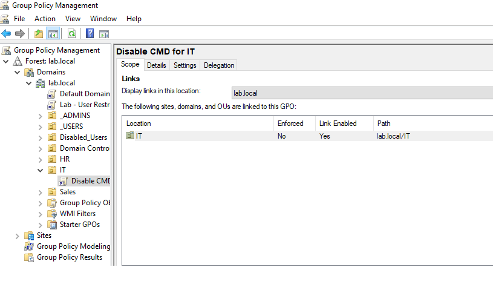
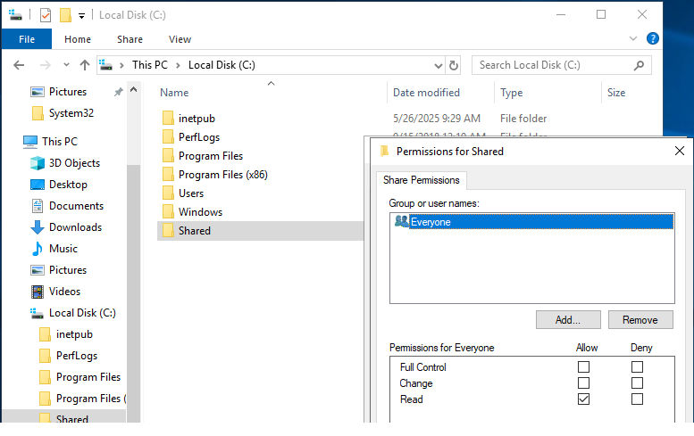
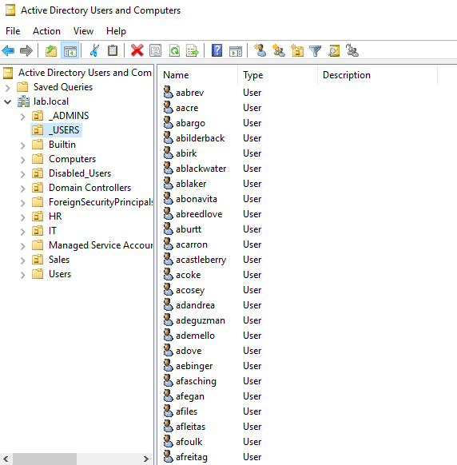

# Active Directory Lab

## Lab Setup
- **Domain Controller:** Windows Server 2019 (`DC01`)
- **Client:** Windows 10 (`Win10-Client`)
- **Domain:** lab.local
- **Network:** NAT with static IPs (DC01: 192.168.100.10, Client: 192.168.100.20)

## Simulated Tasks Completed
- Created Organizational Units (OUs): `HR`, `IT`, `Sales`, and `Disabled_Users`
- Created user accounts with appropriate logon names (UPN and SAMAccountName):
  - Alice Smith (`asmith@lab.local`, `asmith`) in HR
  - Bob Johnson (`bjohnson@lab.local`, `bjohnson`) in IT
  - Carol Jones (`cjones@lab.local`, `cjones`) in Sales
- Set temporary passwords requiring password change at next logon
- Tested user logins on the client VM (`Win10-Client`)
- Simulated password resets and account disabling/enabling

## Tools and Features Used
- Active Directory Users and Computers (ADUC)
- Group Policy Management (preparing to configure GPOs)
- VMware Workstation Pro for VM setup and networking
- Windows Server 2019 and Windows 10 OS

## Screenshots

## What I Learned
- How to set up a Windows Server as a Domain Controller
- Creating and organizing OUs for departmental management
- User account creation and managing logon names (UPN and SAMAccountName)
- Simulating help desk tasks: user logins, password resets, account enabling/disabling
- Networking VMs in NAT mode for internal communication

## Phase 3 – GPOs, File Shares, DHCP, and User Management

### Group Policy
- Created and linked a GPO (`Disable CMD for IT`) to the `IT` OU
- Configured GPO to block Command Prompt via User Configuration settings
- Verified application by logging into the client machine and testing policy behavior

### Shared Folder & Network Drive
- Created a shared folder `C:\Shared` on `DC01`
- Configured share and NTFS permissions (Everyone - Read; `bjohnson` - Full Control)
- Mapped the shared folder as a network drive on the Windows 10 client machine

### User & OU Management
- Used a PowerShell script to bulk-generate 1000+ AD users with default passwords
- Created `_ADMINS` and `_USERS` organizational units
- Moved `Eve Goff (egoff)` to `_ADMINS` and all other users to `_USERS`

### DHCP and NAT Setup
- Installed DHCP Server role on `DC01` and created an IP scope:
  - Start IP: 192.168.100.20  
  - End IP: 192.168.100.200
- Enabled NAT for future simulation of outbound internet access

## Screenshots

## What I Learned
- Creating and linking GPOs to specific OUs
- How to manage file and folder permissions using both share and NTFS settings
- Mapping network drives for user convenience
- Automating user creation in AD using PowerShell
- Setting up DHCP scopes and basic NAT routing
