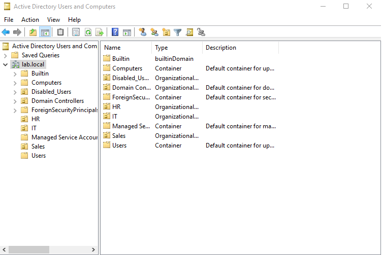
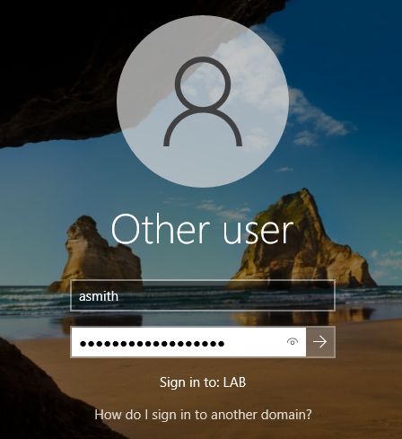

# Active Directory Lab

## Lab Setup
- **Domain Controller:** Windows Server 2019 (`DC01`)
- **Client:** Windows 10 (`Win10-Client`)
- **Domain:** lab.local
- **Network:** NAT with static IPs (DC01: 192.168.100.10, Client: 192.168.100.20)

## Simulated Tasks Completed
- Created Organizational Units (OUs): `HR`, `IT`, `Sales`, and `Disabled_Users`
- Created user accounts with appropriate logon names (UPN and SAMAccountName):
  - Alice Smith (`asmith@lab.local`, `asmith`) in HR
  - Bob Johnson (`bjohnson@lab.local`, `bjohnson`) in IT
  - Carol Jones (`cjones@lab.local`, `cjones`) in Sales
- Set temporary passwords requiring password change at next logon
- Tested user logins on the client VM (`Win10-Client`)
- Simulated password resets and account disabling/enabling

## Tools and Features Used
- Active Directory Users and Computers (ADUC)
- Group Policy Management (preparing to configure GPOs)
- VMware Workstation Pro for VM setup and networking
- Windows Server 2019 and Windows 10 OS

## Screenshots

## What I Learned
- How to set up a Windows Server as a Domain Controller
- Creating and organizing OUs for departmental management
- User account creation and managing logon names (UPN and SAMAccountName)
- Simulating help desk tasks: user logins, password resets, account enabling/disabling
- Networking VMs in NAT mode for internal communication

